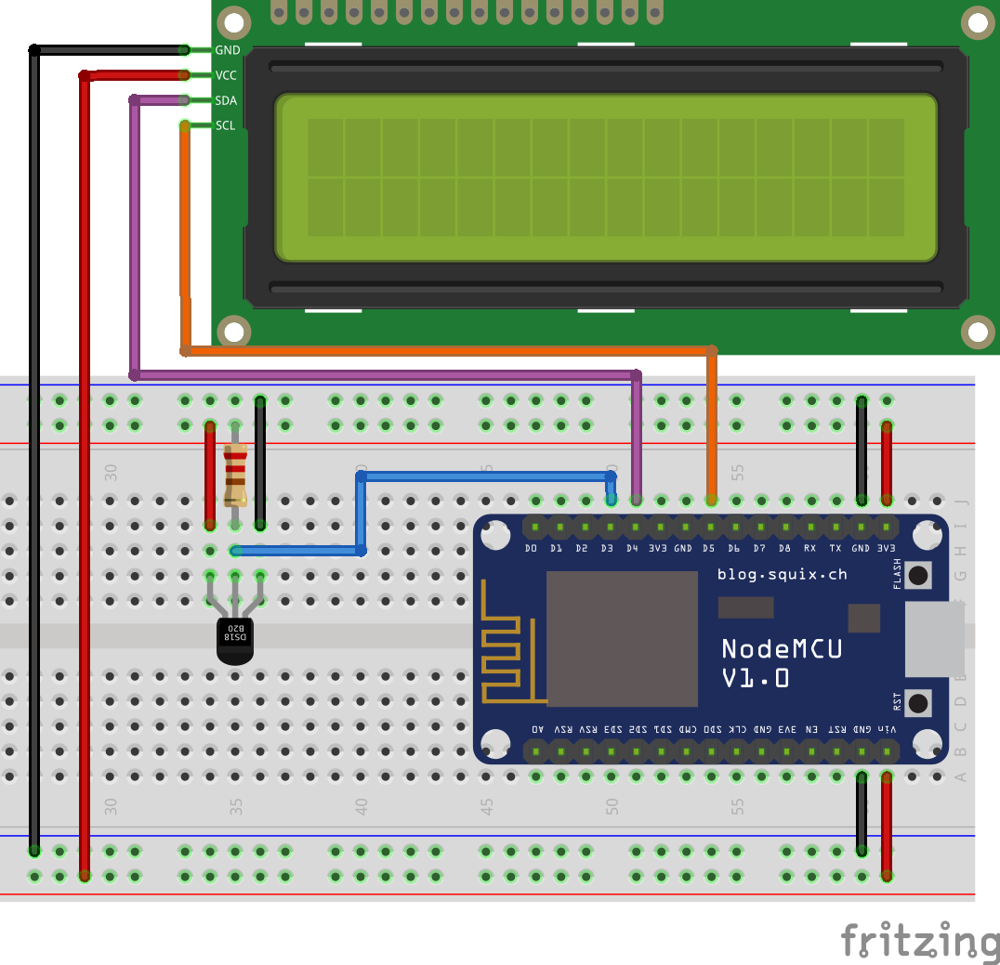

# iot-temp-to-lcd

ESP8266 temperature display

## Required libraries

[OneWire](https://github.com/PaulStoffregen/OneWire)
[DallasTemperature](https://github.com/milesburton/Arduino-Temperature-Control-Library)
[LiquidCrystal_I2C](https://github.com/marcoschwartz/LiquidCrystal_I2C)

## Wiring

### DS18B20

